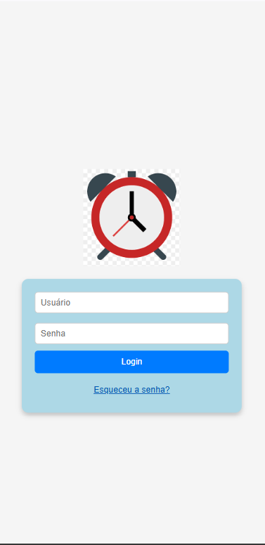
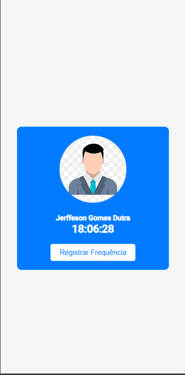
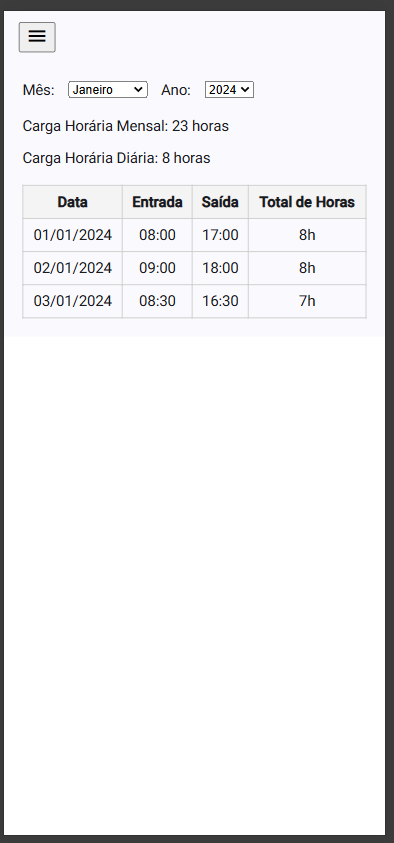

# PontoEletronicoSpaFuncionario

##Descrição Geral

A aplicação é uma plataforma de gestão de ponto e frequência voltada para usuários que precisam registrar e acompanhar suas atividades de trabalho. Ela permite o registro diário de ponto, visualização de um resumo mensal das horas trabalhadas, e navegação responsiva através de um menu hambúrguer. A aplicação utiliza dados fictícios para simular a experiência do usuário ao interagir com os registros e relatórios.

## Imagens

